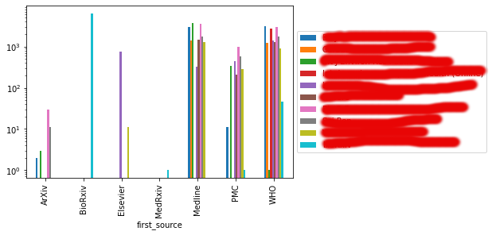
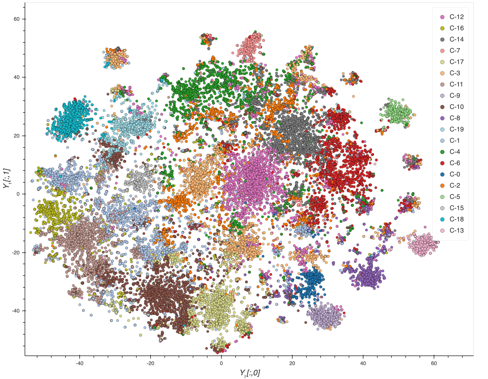

# Assignment 3 - Data Analysis

**Assessment weight: 25% of the total unit assessment.**

**Penalty for late submission: 2.5 marks per day late (or part thereof).** This represents 10% of the total available as indicated in the [unit guide](https://unitguides.mq.edu.au/units/search/2021?query=COMP8210).

# Assignment description

In this assignment you will provide data analysis within the context of a practical application. The assignment is designed so that it can be completed using Python packages introduced during the lectures and workshops of weeks 7 to 10.

*All the exercises in this assignment must be completed in a single Python Jupyter notebook.*

## Topic: Analysis of medical publications about COVID-19

The current pandemic has triggered an unprecedented amount of published medical research with the aim to find treatments and vaccinations as soon as possible. This has also led to efforts to gather these research publications and conduct text information retrieval and text mining on them. In this assignment we will use a fragment of the most widely used resource of this kind: CORD-19. This resource has been made available via several outlets, probably the most popular of which is Kaggle:

* https://www.kaggle.com/allen-institute-for-ai/CORD-19-research-challenge

We will use Kaggle's subset stored in the file `metadata.csv`. The data available in the above link is continuously changing. To ensure consistency among all submissions, please use the following local copy:

* [metadata.csv.zip](https://mqoutlook-my.sharepoint.com/:u:/g/personal/diego_molla-aliod_mq_edu_au/Ee0kObk0jSZLlH-yvK7XelABNul2YN9TIEjVTaoZy4C2hg?e=B41qEe) (390MB download)

Open the CSV file and examine its contents. You will see that the data is organised in columns containing the following information (among others):

* Source (e.g. PMC, Medline, etc)
* Publication title
* Journal title
* DOI
* Abstract
* Date of publication

This assignment is divided in several tasks. Each task addresses a question that you need to answer by writing Python code, producing one or more charts, and explaining how the chart(s) answer(s) the question. Some of the tasks will tell you exactly what kind of chart you need to produce, but other tasks will only express a need for some information and you need to decide what chart or set of charts would help find the information.

Your report must be structured using the task titles as headings. Each section must contain the following subheadings or equivalent:

* **Chart** (or **Charts** when appropriate), where you insert the Python code that generates the charts, and the resulting charts. Make sure that the charts have the appropriate titles and legends. 
* **Discussion**, where you explain how the chart(s) can be used to answer the question asked in the task.

*Note that, depending on your computer, the size of the data set may be too large for some of the tasks below. If that is the case, feel free to work using a random sample of the data. In fact, it is advisable that you conduct your first tests using a small sample and then report the results on a larger sample (or the entire data set if your computer allows).*

## Task 1 (5 marks) - What is the distribution of journals per source?

Identify the 10 most frequent journals. Then, for each publication source, display the distribution of publications in each journal. The final result should be presented as a clustered column chart like the one below. We have obscured the journal names and we have not added a title or sensible axis names -- your solution should have this information.

You also need to explain how you produced the chart, and how to interpret it.

* hint 1: The chart was made using panda's plotting tools but feel free to use your favourite tool.
* hint 2: Note that the y axis is using a log transform.
* hint 3: If a publication has multiple sources, use the first source.

## Task 2 (5 marks) - What are the main clusters?

Using the text from the abstracts, cluster the data set and visualise the clusters. To cluster the data, you can use KMeans or another clustering method of your choice. Choose a reasonable metric to determine the similarity between abstracts, and choose a reasonable number of clusters.

To visualise the clusters, produce a 2D plot where the axes represent a 2D representation of each document, each document is represented as a marker, and the colour of the marker indicates the cluster to which the document belongs.

The visualisation may look like this. Just note that the image below is using different data, so your clusters will look different, and the number of clusters may be different too (source: https://www.kaggle.com/maksimeren/covid-19-literature-clustering).

* hint: to obtain the 2D representation of a document, try Principal Component Analysis (PCA) or t-SNE.

## Task 3 (5 marks) - For each cluster, what are the most representative words?

To complete this task, create a **word cloud** for each cluster so that the size of each word in a word cloud represents the importance of the word in the corresponding cluster. When you build the word clouds, make sure that the words displayed are informative. For example, remove stop words, and remove other words that are common across all clusters.

It is your choice to determine how to determine the importance of a word. Possible options may be:

* Use word frequency and remove stop words plus other words you may think are not informative.
* Use tf.idf.
* Research techniques used for extracting keywords.

## Task 4 (5 marks) - What are the most common topics?

To complete this task, you need to conduct **topic modelling** in order to identify the main topics of the opinions expressed in the tweets. For example, you can perform Latent Dirichlet Allocation. Present the results in the appropriate chart or charts, and write how the charts answer the question of this task. To perform topic modelling you normally need to specify the number of topics. In your report, write how you determined the number of topics. For example, did you try different numbers of topics and choose the number that reported most satisfactory results? If so, how did you determine the most satisfactory results?

## Task 5 (5 marks) - What are the most common topics in each cluster?

Use the information from the topics of task 4 to characterise the topics in each cluster. How to do this, and how to express this information, is up to you.

**What kind of information do we want to know?** Here are some questions that you may want to answer:

1. Are there any topics that are more (or less) common in the clusters?
2. For each topic, what are the most representative clusters?
3. For each cluster, what are its most representative topics?
2. What additional information does the topic modelling stage tell us about each cluster?

**What you should not do**: please don't conduct a separate topic modelling in each cluster. We want to know whether, for example, cluster 1 and cluster 2 share many common topics. If you conduct a separate topic modelling in each cluster, we will not know if they have topics in common.

## Submission

There are two submission boxes.
* **Turnitin submission**: In this submission box, submit your report as a PDF file. This file can be your Python notebook exported to PDF. **Do not submit your Python .ipynb file here.**
* **Code submission**: In this submission box, submit your Python notebook with all the code that generated the PDF report. Make sure that we understand how the code can produce the charts and other analysis results described in the PDF report. Make sure that the Python notebook contains the code, output, and your analysis.

## A note about plagiarism

By submitting this assignment you acknowledge that it is your own work and that you did not copy material from other people or the web. There are penalties for plagiarism. 

## Assessment Rubric

Each task will be assessed according to the rubric attached to the assignment.
